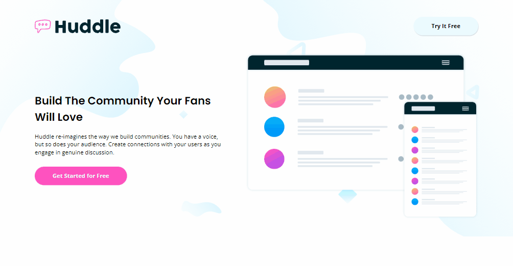

# Desafio Landing Page com Blocos Alternados - Frontend-Mentor

Este é um desafio de Landing Page com Blocos Alternados proposto pelo site Frontend-Mentor.

## Tabela de Conteúdos

- [Visão Geral](#visão-geral)
    - [Imagens](#imagens)
    - [Link da página](#link)
- [Processo](#processo)
    - [Linguagens utilizadas](#linguagens-utilizadas)
    - [O que aprendi](#o-que-aprendi)
    - [Possíveis evoluções](#possíveis-evoluções)
- [Autor](#autor)

## Visão-geral

### Imagens

<br>

````
Versão de Desktop
````

   

<br>

````
Versão Mobile
````

 

### Link

- Página no GitHub Pages: <a href="https://julio-mansan2.github.io/landing-page-com-blocos-alternados/">Clique aqui!</a>

## Processo

### Linguagens utilizadas

<br>

- Marcações semânticas de HTML5
- Propriedades de customização do CSS3

<br>

### O que aprendi

<br>

- Utilizar box-shadow em containers:

````css

box-shadow: 1px 2px 0px 0px rgba(0, 0, 0, 0.12);

````

<br>

- Utilizar variáveis:

````css

:root {
    --very-pale-cian: hsl(193, 100%, 96%);
    --grayish-blue: hsl(208, 11%, 55%);
    --pink: hsl(322, 100%, 66%);
    --very-dark-cian: hsl(192, 100%, 9%);
}

````
<br>

- Utilizar rem ao invés de px para o font-size:

````css

    font-size: 1.4rem;

````
<br>

- Inverter as cores de uma imagem utilizando filter:

````css

    filter: invert(100%);
    
````
<br>

### Possíveis evoluções

<br>

- Sobrepor cores corretas nas imagens;
- Escrever códigos mais compactos;
- Entender de forma mais eficaz o funcionamento do font-awesome;
- Posicionar as listas de forma que o texto não fique na mesma linha do ícone escolhido.

<br>

## Autor

GitHub - <a href="https://github.com/julio-mansan2">julio-mansan2</a> <br>
Front-end Mentor - <a href="https://www.frontendmentor.io/profile/julio-mansan2">julio-mansan2</a> <br>